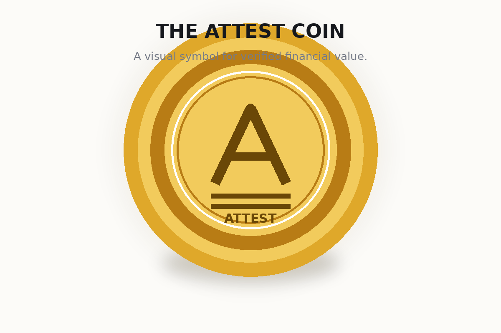
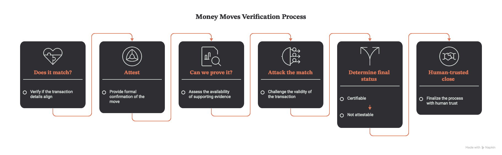
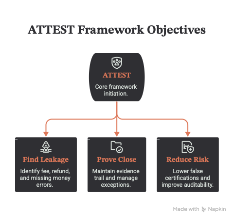
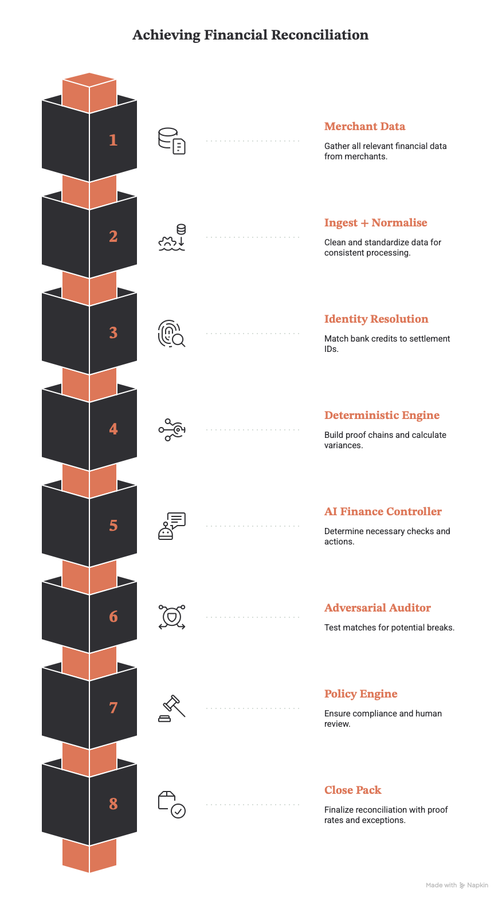

<div align="center">


# ATTEST

### Prove where the money came from — and whether it should have.

**An AI Finance Controller for merchant reconciliation.**

[](https://attest-nu.vercel.app)
[](LICENSE)


</div>

---

## What is Attest?

Imagine a shop gets **₹19.4 lakh** from a payment gateway.

The gateway report says the money is correct. The bank says the same money arrived. Everything appears to match.

But inside that total, the gateway could have **overcharged a fee** while a different refund was **under-deducted**. The two mistakes can cancel each other out.

So the books say **₹0 variance** — while the merchant is actually wrong by **₹8,495.80**.

**That is the problem Attest solves.**

Attest does not stop at *“the totals match.”* It traces the money line by line, checks the evidence, attacks suspicious matches, and refuses to certify a close when the evidence is not strong enough.

> **Razorpay tells you what happened. Attest proves whether it should have.**

---

## 🪙 The Attest coin



---

## See it in 30 seconds

Open the **[live demo](https://attest-nu.vercel.app)** and run the demo.

You will see a settlement batch where conventional reconciliation says:

```text
Bank credit              ₹19,40,799.80
Settlement total         ₹19,40,799.80
Variance                         ₹0.00
Status                    ✓ Reconciled
```

Attest then looks inside the batch:

```text
Fee overcharged             ₹3,600.00
GST on fee                    ₹648.00
Refund under-deducted       ₹4,247.80
────────────────────────────────────
Actually wrong by           ₹8,495.80
```

The totals match. **The evidence does not.**

---

# How Attest works

## Architecture


```text
                    ┌──────────────────────┐
                    │     MERCHANT DATA    │
                    │                      │
                    │ Orders               │
                    │ Settlements          │
                    │ Bank statements      │
                    │ Refunds / disputes   │
                    │ COD / shipments      │
                    │ Contracts / tax      │
                    └──────────┬───────────┘
                               │
                               ▼
                    ┌──────────────────────┐
                    │ INGEST + NORMALISE   │
                    │                      │
                    │ ₹ → integer paise    │
                    │ Clean + standardise  │
                    └──────────┬───────────┘
                               │
                               ▼
                    ┌──────────────────────┐
                    │ IDENTITY RESOLUTION  │
                    │                      │
                    │ Bank credit →        │
                    │ settlement_id        │
                    │ Ambiguity → escalate │
                    └──────────┬───────────┘
                               │
                               ▼
                    ┌──────────────────────┐
                    │ DETERMINISTIC ENGINE │
                    │                      │
                    │ Match batches        │
                    │ Build proof chains   │
                    │ Calculate variances  │
                    └──────────┬───────────┘
                               │
                               ▼
                    ┌──────────────────────┐
                    │ AI FINANCE CONTROLLER│
                    │                      │
                    │ What should I check? │
                    │ What should happen   │
                    │ next?                │
                    └──────────┬───────────┘
                               │
                               ▼
                    ┌──────────────────────┐
                    │ ADVERSARIAL AUDITOR  │
                    │                      │
                    │ Try to break a       │
                    │ match before trusting│
                    │ it                    │
                    └──────────┬───────────┘
                               │
                               ▼
                    ┌──────────────────────┐
                    │ POLICY ENGINE        │
                    │                      │
                    │ CERTIFIABLE          │
                    │ HUMAN REVIEW         │
                    │ NOT ATTESTABLE       │
                    └──────────┬───────────┘
                               │
                               ▼
                    ┌──────────────────────┐
                    │ CLOSE PACK           │
                    │                      │
                    │ Proof rate           │
                    │ Exceptions           │
                    │ Recovery actions     │
                    │ Unexplained residual │
                    └──────────────────────┘
```

**Core principle:** AI can decide what to investigate, but the money math and certification rules stay deterministic.

---

## Verification workflow



The workflow moves from matching to proof, then challenges the match before certification. The final outcome can be **Certifiable**, **Human Review**, or **Not Attestable**.

## The key idea: prove the chain, not just the total

A transaction is considered proven only when the evidence chain holds:

```text
order
  ↓
payment
  ↓
fee calculation
  ↓
tax base
  ↓
settlement batch
  ↓
bank credit
  ↓
ledger
```

One broken link means the line is **not proven**, even if the final totals happen to agree.

---

# Where AI fits

Attest deliberately separates **reasoning** from **financial truth**.

| Part | AI? | Why |
|---|:---:|---|
| What to investigate next | ✅ | Good problem-solving task for an agent |
| Root-cause explanation | ✅ | Turns evidence into an understandable finding |
| Narration / document parsing | ✅ | Handles messy language and changing formats |
| Claim / journal drafting | ✅ | Produces a useful human-review draft |
| Match arithmetic | ❌ | Must be auditable and deterministic |
| Tolerances / thresholds | ❌ | Policy should not drift because of a model |
| Ledger posting | ❌ | Human approval remains required |

The model planner and deterministic rules planner use the same validation, tools, and policy safety envelope.

---

# Why Attest is different

### Traditional reconciliation

```text
Do the totals match?
        ↓
      YES ✅
        ↓
      CLOSE
```

### Attest

```text
Do the totals match?
        ↓
Can every line be proven?
        ↓
Attack the matches
        ↓
Investigate exceptions
        ↓
Measure unexplained residual
        ↓
Can policy certify it?
   ↙       ↓        ↘
 YES    REVIEW      NO
 ✅       👤        ❌
```

This is why Attest reports more than a match rate:

| Metric | Simple question |
|---|---|
| **Match rate** | Did the totals agree? |
| **Proof rate** | Can the money be traced end to end? |
| **False-match rate** | How many “matches” failed an adversarial check? |
| **Unexplained residual** | How much money is still not accounted for? |

---

# 💼 Business approach

Attest is best understood as a **financial control layer**, not just another reconciliation screen.

## Who pays for it?

The immediate customer is a merchant or finance team that already has to reconcile money across multiple systems.

Typical users:

- D2C and e-commerce merchants
- Marketplaces
- Finance / accounting teams
- CA and bookkeeping firms managing multiple merchants
- Businesses with large refund, COD, courier, or payment-gateway flows

## What problem are they buying?

They are not really buying a “better match rate.”

They are buying:

**less money leakage + fewer hidden accounting errors + a defensible month-end close.**

### Business value



### Business model at a glance

Attest is positioned as **B2B SaaS for finance teams**, with pricing tied to reconciliation volume and the value of recovered leakage.

| Revenue stream | Customer | Value |
|---|---|---|
| **SaaS subscription** | Merchants / finance teams | Continuous reconciliation + proof of close |
| **Usage-based** | High-volume merchants | Pay by settlements or records processed |
| **CA / finance firm plan** | Accounting partners | One workspace for many merchant closes |
| **Recovery success fee** | Merchants with claimable leakage | Pay when verified recoverable money is won |

## How it could make money

### 1. SaaS subscription

Charge merchants based on reconciliation volume, such as monthly transactions or settlements.

```text
Starter       → small merchant
Growth        → growing D2C / marketplace
Enterprise    → high-volume finance teams
```

### 2. Usage-based pricing

A lower fixed platform fee plus a small fee per processed settlement / reconciliation batch.

### 3. CA / finance-firm plan

A multi-client workspace where one finance partner can run closes for many merchants.

### 4. Recovery-linked upside

For specific claim workflows, Attest could eventually charge a small success fee on **verified, recoverable leakage**.

That model aligns the product with the customer's outcome:

> **Money recovered, not dashboards opened.**

---

# Why a merchant would keep paying

The strongest retention loop is not “more AI features.” It is:

```text
Connect financial sources
        ↓
Run every close
        ↓
Find exceptions
        ↓
Recover money / close safely
        ↓
Store the evidence trail
        ↓
Return next month
```

Once Attest becomes the system that produces the monthly **proof of close**, replacing it means losing historical evidence, exception context, and recovery tracking.

---

# Product loop

```text
SOURCE DATA
   ↓
RECONCILE
   ↓
PROVE
   ↓
ATTACK
   ↓
EXCEPTION REGISTER
   ↓
RECOVERY / HUMAN REVIEW
   ↓
SEALED CLOSE PACK
   ↓
NEXT PERIOD
```

The long-term opportunity is to move from a **month-end detective tool** to a **continuous finance control system**.

Continuous ingest is the most important roadmap change because some recoverable findings can expire before a monthly close.

---

# Results from the benchmark

Against the generated benchmark corpus:

```text
Orders processed                 1,200
Source records                   3,043

Batches tied by conventional check   20 / 22   = 90.9%
Lines proven                         743 / 1018 = 73.0%
Matches overturned                   15 / 22   = 68.2%
Held-out recall                            75.0%
False positives                            0
Recoverable money                  ₹87,256.57
Unexplained residual               ₹46,617.32
```

The important number is not that the match rate is high.

It is that **proof rate is lower**, and the adversarial pass overturns matches that look safe at first glance.

In the showcased benchmark close, the final residual exceeds the policy threshold, so Attest refuses to certify:

> **NOT ATTESTABLE**

That refusal is a feature, not a failure.

---

# Security & trust

Attest treats financial data as something the system must **earn the right to certify**.

### Money is integer paise

No floating-point arithmetic touches money.

### Ambiguity is escalated

When multiple records could explain the same bank credit, Attest does not guess. It escalates the ambiguity instead.

### Tamper-evident close packs

Every close pack carries a SHA-256 digest of the rendered document.

### Optional AI

The core pipeline can run without an API key, account, or network. AI is an enrichment layer rather than the source of truth for the financial numbers.

---

# Quick start

Zero runtime dependencies. Python 3.10+.

```bash
# Run the compensating-error demo
python3 -m attest.demo

# Generate the benchmark corpus
python3 -m attest.generate --out data --orders 1200

# Run a close and generate the HTML close pack
python3 -m attest.run --data data --html web/close-pack.html

# Verify the close-pack seal
python3 -m attest.seal --verify web/close-pack.html
```

Run the full verification suite with:

```bash
python3 scripts/verify.py
```

---

# Running against real Razorpay data

Attest includes a Razorpay Settlement Recon connector using the Settlement Recon API.

```bash
python3 -m attest.connect --year 2026 --month 8 --ping
python3 -m attest.connect --year 2026 --month 8
```

A key design choice is that Attest keeps `settlement_id` as the authoritative batch identity and treats the bank UTR as audit evidence rather than blindly using it as the grouping key.

---

# Repository structure

```text
attest/
├── money.py       # integer-paise arithmetic
├── world.py       # true-world benchmark generation
├── defects.py     # labelled defect injection
├── documents.py   # source document generation
├── ingest.py      # normalisation + key resolution
├── engine.py      # deterministic matching + proof chains
├── audit.py       # adversarial checks
├── recovery.py    # recoverable exceptions + deadlines
├── score.py       # benchmark scoring
├── report.py      # close-pack generation
├── seal.py        # tamper-evidence verification
├── engines.py     # reasoning layer
└── sources/       # Razorpay connector

api/
├── close.py       # close API
└── explain.py     # explanation API

web/
├── index.html     # landing page
└── app.html       # application UI

brand/
└── attest-mark.svg
```

---

# What is built vs roadmap

### ✅ Built

- Synthetic truth-first benchmark corpus
- Seven-source ingestion and normalisation
- Deterministic reconciliation engine
- Per-line proof chains
- Six adversarial falsification hypotheses
- Typed exception register
- Deadline-aware recovery layer
- Held-out accuracy scoring
- Self-contained HTML close pack
- Refusal / `NOT ATTESTABLE` path
- Optional AI reasoning layer

## Product roadmap



The roadmap moves Attest from a month-end reconciliation tool toward **continuous financial control** — connecting financial sources, detecting issues earlier, supporting multiple merchants, tracking recovery, integrating with ledgers, and learning from resolved exceptions.

### 🚧 Roadmap

- Direct OAuth / API connectors for more financial systems
- Continuous daily ingest instead of batch-only close
- Multi-tenant CA / accounting-firm workspace
- Claim filing and status tracking
- Tally / Zoho ledger export
- Learning from real recovery outcomes

---

# The idea in one picture

```text
             ┌────────────────────┐
             │      MONEY MOVES   │
             └─────────┬──────────┘
                       ↓
             ┌────────────────────┐
             │   DOES IT MATCH?   │
             └─────────┬──────────┘
                       ↓
                ┌─────────────┐
                │   ATTEST    │
                │     🪙      │
                └──────┬──────┘
                       ↓
             ┌────────────────────┐
             │   CAN WE PROVE IT?│
             └─────────┬──────────┘
                       ↓
             ┌────────────────────┐
             │   ATTACK THE MATCH│
             └─────────┬──────────┘
                       ↓
              ┌────────┴────────┐
              ↓                 ↓
        ✅ CERTIFIABLE      ❌ NOT ATTESTABLE
              │                 │
              └────────┬────────┘
                       ↓
             HUMAN-TRUSTED CLOSE
```

---

# Design language

Attest uses an accounting-inspired visual system:

- **Navy** → trust and verification
- **Gold** → the coin / financial value
- **A + double rule** → a verified total
- **Paper / ink** → accounting documents and auditability

The brand's double rule is inspired by the accounting convention of marking a figure as final and verified.

---

## Learn more

- **Live app:** https://attest-nu.vercel.app
- **Architecture:** [`ARCHITECTURE.md`](ARCHITECTURE.md)
- **Use cases:** [`USE-CASES.md`](USE-CASES.md)
- **Brand:** [`brand/README.md`](brand/README.md)

---

## License

MIT

<div align="center">


**Attest — prove the close.**

</div>
