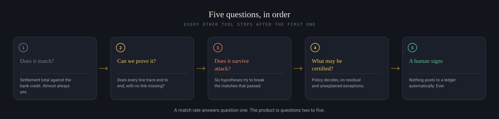
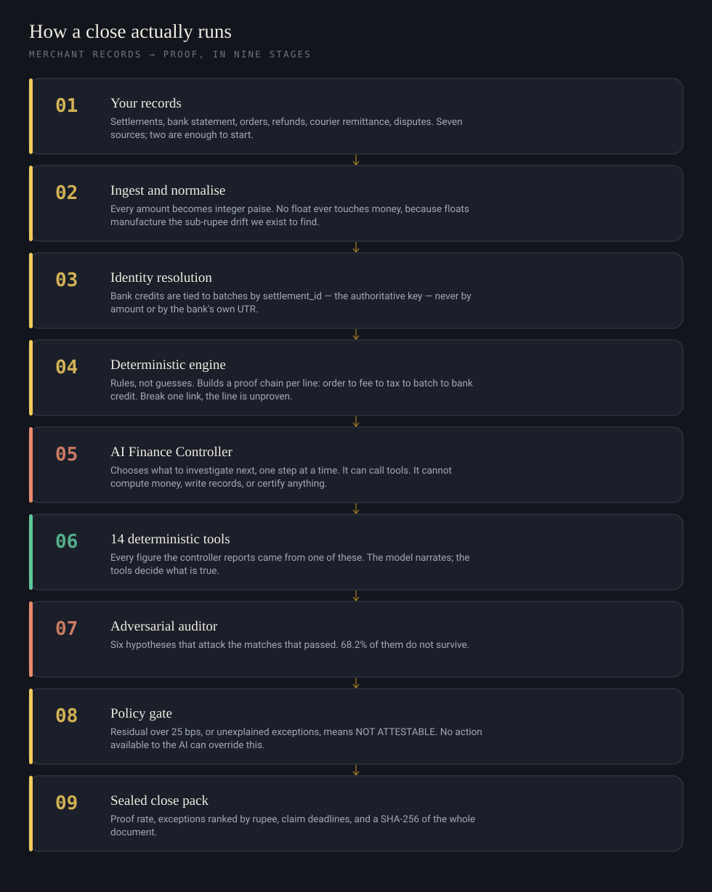
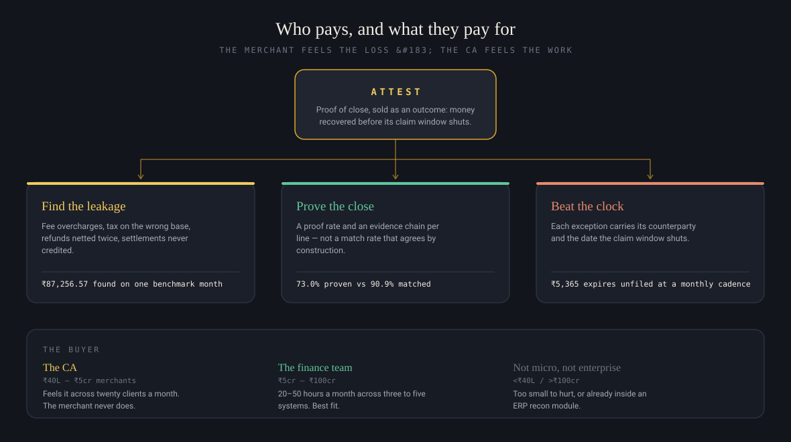

<p align="center">
  <a href="https://attest-nu.vercel.app"><b>Live demo</b></a> &nbsp;·&nbsp;
  <a href="ARCHITECTURE.md">Architecture</a> &nbsp;·&nbsp;
  <a href="USE-CASES.md">Use cases</a> &nbsp;·&nbsp;
  <a href="https://attest-nu.vercel.app/close-pack.html">Example close pack</a>
</p>

---

## The one-sentence version

Reconciliation tools tell you your books **matched**. Attest tells you what your
books can **prove** — and the gap between those two numbers is where the money
goes.

## See it in thirty seconds

Open the [live demo](https://attest-nu.vercel.app) and press **Run the demo
close**. No account, no credentials, no setup.

You will see one settlement batch that agrees with the bank **exactly** — ₹0.00
variance, every automated check passing — with **₹8,495.80** of real error
sitting inside it.

```
     WHAT EVERY TOOL CHECKS              WHAT IS ACTUALLY INSIDE
  ───────────────────────────────    ───────────────────────────────────
  Razorpay says   ₹19,40,799.80      fee overcharged         ₹3,600.00
  Bank shows      ₹19,40,799.80      GST on that overcharge    ₹648.00
  ───────────────────────────────    refund under-deducted   ₹4,247.80
  Difference              ₹0.00      ───────────────────────────────────
  ✓ Reconciled                       actually wrong by       ₹8,495.80
```

Two mistakes of opposite sign, almost exactly cancelling. The batch looks twenty
paise out. It is wrong by ₹8,495.80 — **understated 42,479×**.

Accountants call this a **compensating error**. A check on totals cannot find it
by construction, which is the entire reason this project exists.

Locally, in one command:

```bash
python3 -m attest.demo
```

---

## Why a match rate is the wrong number

Razorpay pays exactly what its own settlement report says it will. So the report
and the bank agree **by construction** — that tie proves the money arrived, and
nothing whatsoever about whether the deductions inside it were correct.

Ask a payment gateway to reconcile itself and the answer is always yes. That is
not a bug in the tool; it is a category error in the question.



---

## What comes out

Three numbers, and the second two are the product.

| | | |
|---|---|---|
| **90.9%** | Match rate | *"Did the money arrive?"* — what everyone reports |
| **73.0%** | **Proof rate** | *"Can I show every deduction was correct?"* — what we report |
| **68.2%** | **False-match rate** | *"How many matches fall apart under attack?"* — what nobody reports |

Measured on the benchmark corpus: 1,200 orders, 3,043 source records, seven systems.

```
processed 3,043 records in 0.02s

BATCHES TIED (conventional check)     20/22   =  90.9%
LINES PROVEN (evidence chain)        743/1018 =  73.0%
MATCHES OVERTURNED (adversarial)      15/22   =  68.2%

recall, held-out defect classes            75.0%   (3 of 4 found, 1 missed)
false positives                                0
recoverable                           ₹87,256.57   across 283 items
cost of closing monthly                ₹5,365.00   (16 claims expire unfiled)
unexplained residual                  ₹46,617.32   (254.5 bps)  -> NOT ATTESTABLE
```

**The close is refused.** ₹46,617.32 could not be attributed to any cause — 254.5
bps against a 25 bps limit — so the status is `NOT ATTESTABLE`. Refusing to
certify is the point of an attestation. A system that always signs is not
attesting to anything.

---

## How it works



The shape that matters is in stages 05 to 08:

> **AI investigates. Deterministic tools prove. Policy decides.**

The controller picks what to look at next — genuinely, one step at a time, not
from a script. Then a deterministic tool answers. The model never computes a
monetary value, never writes a record, and there is **no action available to it
that certifies a close**. Its own action schema does not contain one.

That separation is why it is safe to let a model drive an audit at all.

| | Controller (AI) | Tools (deterministic) | Policy gate |
|---|---|---|---|
| Decides | what to investigate next | what is true | what may be certified |
| Can it touch money? | no | computes it | no |
| Can it certify? | **no — not an available action** | no | yes |

Measured across six agent-benchmark scenarios: **100%** investigation success,
**100%** correct escalation, **0% false certification**. Six scenarios is a small
sample and those perfect scores should be read that way — the honest weak spot is
**41.3% unnecessary tool calls**, reported rather than tuned away.

---

## Why the numbers can be trusted

The benchmark corpus is synthetic, as the track brief specifies — which makes
**the design of the dataset part of the work.** It is generated in a specific
order:

1. Build the **true world** — every rupee, as it should have moved.
2. **Freeze** the truth.
3. Derive the source documents from that truth.
4. Inject **labelled defects into the documents only**.

Because the truth exists before the system does, every accuracy figure is
*measured against labels the agent never sees*, rather than asserted.

**Four defect classes were planted with no detector written for them.** Three
were caught anyway by generic integrity checks. One is still missed, and it is
reported as missed. Recall on the classes we designed for is 100%, which on its
own proves nothing at all. Recall on the held-out classes is **75%** — that is the
number that means something, and the missed class is deliberately left unfixed.

The corpus also separates **defects** from **world facts** — things that make
reconciliation genuinely hard without anyone having erred, such as two identical
orders on the same day, or a refund that legitimately nets into next month.
Flagging one counts as a **false positive**. Most reconciliation demos have no
concept of a false positive at all.

**On your own data, no accuracy figure is quoted.** There is no answer key for a
real month. A tool that quotes you recall on your own data is quoting a number it
cannot have measured. The close pack says so on its face.

---

## Business approach



**The insight is who feels the pain.** The merchant loses the money but never
sees it — it leaves as a rounding difference inside a batch that balanced. The
person who feels it is the chartered accountant doing this across twenty clients
a month, and the three-person finance team burning 20–50 hours reconciling across
five systems. **The CA is the buyer, not the merchant.**

| Annual volume | Who reconciles | Customer | Why |
|---|---|---|---|
| Under ₹40 lakh | The founder, in a notebook | No | Low enough to eyeball; the pain is cash timing, not accuracy |
| ₹40 lakh – ₹5 crore | An external CA, in Tally | **Yes** | The CA feels it across twenty clients a month |
| ₹5 – ₹100 crore | A one-to-three person finance team | **Yes** | Multi-channel, COD, marketplaces. Best fit |
| ₹100 crore + | Controller plus an ERP recon module | No | Already automated, or has staff to absorb it |

**Cadence is the product.** On the sample month, closing monthly instead of daily
lets **₹5,365 across 16 claims expire unfiled** — computed from the same findings
scored against a close that lands 30 days later, not asserted. Courier disputes
die in 14 days. Running daily is not a performance detail; it is the difference
between finding money and recovering it.

**What that makes it sellable as.** Not software priced per seat, but an outcome:
money recovered before its claim window shuts, with the evidence chain attached
so the claim can actually be filed. The close pack is the artefact the CA hands
to an auditor, which is why it is sealed.

**Where it goes next**, in order: Razorpay OAuth so no merchant ever pastes a
key → webhook ingest so the close runs daily rather than monthly → filing the
claims rather than only drafting them → a CA-firm console across many client
merchants → journal export to Tally and Zoho → learning which claim types
actually get paid, and ranking by that.

---

## A close pack you cannot quietly edit

Every close pack carries a SHA-256 digest of the **entire rendered document** —
not a list of facts, the document.

```bash
python3 -m attest.seal --verify web/close-pack.html
```

```
digest     4e008d98 18eb491c 63c73b54 5245f684
INTACT     the whole document hashes to its printed digest.
```

Change one rupee, one date, one letter of the business name, and it reads
`ALTERED`.

A matching digest proves the pack has not been edited since it was sealed. It
does **not** prove who produced it — anyone holding the code can seal a document.
That is true of every self-contained checksum, which is why the honest word is
**tamper-evident**, not tamper-proof.

Authorship comes from the close record: when a close runs, its digest is written
to a table with **no update policy and no delete policy**. A merchant can add a
seal; nobody can alter one afterwards — not the merchant, not us. Your auditor
asks it one question: *was this exact digest recorded, and when?*

---

## Quick start

```bash
# the compensating-error demo, start to finish
python3 -m attest.demo

# generate the benchmark corpus (sources + held-out ground truth)
python3 -m attest.generate --out data --orders 1200

# close it, and write the pack the site links to
python3 -m attest.run --data data --html web/close-pack.html

# check the seal on what that produced
python3 -m attest.seal --verify web/close-pack.html

# watch the controller investigate, step by step
python3 -m attest.controller --demo

# the agent benchmark: six scenarios, scored
python3 -m attest.agentbench
```

No dependencies. Python 3.11+, standard library only.

### One command that checks every claim on this page

```bash
python3 scripts/verify.py
```

58 checks across environment, pipeline, integrity, outputs, money arithmetic, the
demo, endpoints, the controller, the reasoning layer, and the Razorpay client. If
a number in this README is wrong, this fails.

---

## Where AI is used, and where it is deliberately not

| Component | AI? | Why |
|---|---|---|
| Root-cause explanation | yes | Turning a ₹3,600 variance into a stated cause needs reasoning over context |
| Narration parsing | yes | Bank statement formats drift; free text is a language problem |
| **Match arithmetic** | **no** | Must be auditable. A probabilistic matcher cannot be trusted with money. |
| **Tolerance and threshold logic** | **no** | Deterministic by design |
| **Posting to the ledger** | **no** | Drafted for human approval, never automatic |

The division is visible in the interface. Every explanation is labelled either
**Verified by Attest engine** (deterministic, produced by the same code that
computed the figures) or **AI explanation** (written by a model from figures the
engine had already published). The model is handed a nine-field allowlist and no
source documents, so it has nothing to hallucinate a number from.

**The whole pipeline runs with no API key, no account and no network.** With no
model configured, explanations fall back to the deterministic path and nothing
else changes. That is a design decision, not a limitation — for a product
handling a merchant's financial records, inference you can run locally is an
architectural advantage.

## Running against real Razorpay data

`attest/sources/razorpay_api.py` calls the live Settlement Recon API over HTTP
Basic auth, using only the standard library:

```
GET https://api.razorpay.com/v1/settlements/recon/combined?year=YYYY&month=MM
```

```bash
python3 -m attest.connect --year 2026 --month 8 --ping   # check credentials
python3 -m attest.connect --year 2026 --month 8          # pull and audit a month
```

Two things about the real API shaped the design. Amounts arrive as **integers in
paise**, which is why Attest is integer-paise throughout and no float touches the
money. And every row carries **both `settlement_id` and `settlement_utr`** — the
UTR is issued by the correspondent bank, is not a Razorpay key, and grouping on
it produces confident wrong batches. Attest groups on `settlement_id` and keeps
the UTR for the audit trail only.

Before reconciling anything, the importer audits the source data itself: whether
Razorpay's own `credit` agrees with `amount − fee − tax`, and whether any two
batches share a UTR. Both are reported rather than smoothed over.

**Razorpay cannot prove Razorpay.** Connect a Razorpay key and supply nothing
else and both rates are 0% — the report and the payment agree by construction, so
that agreement carries no information. Evidence has to come from somewhere that
is not the party being checked.

## Security posture

| | |
|---|---|
| **Razorpay secrets** | Never stored. The hosted app refuses `rzp_live_…` outright; a test key is used for one request and discarded. The database holds a masked key id and nothing else. |
| **The serverless function** | Holds no credential of its own — no service key, no admin role, no database password. Every write goes to PostgREST bearing the caller's own token, so it can never touch a row its caller could not. If `api/close.py` leaked in full it would grant an attacker nothing. |
| **Data isolation** | Row-level security, tested rather than assumed: as the owner 1 row visible, as another signed-in user 0, anonymous 0, and a forged insert claiming another user's id rejected. |
| **Accounts** | Optional. The demo and the full reconciliation path work signed out; an account only keeps your closes. |
| **AI prompts** | A nine-field allowlist of already-published figures. No source document, key or statement line can reach a model. |

## Financial bugs found during the build

Nine were caught in total ([`INVARIANTS.md`](INVARIANTS.md) has the full list). These two
are the quiet kind — wrong numbers rather than crashes — and both are worth
reading if you are assessing whether this was built carefully.

**A legitimate zero treated as missing.** `ReconRow.net` read
`self.credit if self.credit else (amount - fee - tax)`. A credit of exactly zero
— a fully refunded payment, an adjustment that nets out — is falsy, so it fell
through to a *computed* figure, silently replacing what Razorpay reported with
something else. `net_disagrees_by` had the same shape, so a reported zero that
disagreed was reported as agreeing: the check failed precisely where it mattered
most. `credit` is now `int | None`, absence and zero are distinct, and
`tests/test_money_edges.py` covers it.

**Adversarial verdicts counted as recoverable money.** The exception register
mixes broken proof chains, batch findings and verdicts from the adversarial pass.
An "offsetting pair" is the *same rupees* as the MDR chain break and the refund
variance that compose it — and all three were being summed into the recoverable
total, overstating the benchmark by ₹846.90 and the demo by roughly ₹17,000.
Verdicts are now tagged, excluded from recovery, and shown separately. Overstating
what a merchant can recover is the one direction a finance tool must never err in.

## Repository layout

```
attest/
  money.py       integer paise arithmetic — no float touches money
  world.py       generates the true world for one merchant-month
  defects.py     injects labelled defect classes into the documents only
  documents.py   renders the world into the source files a merchant receives
  generate.py    corpus CLI
  demo.py        the deterministic compensating-error scenario
  ingest.py      loading, normalisation, and key resolution
  engine.py      deterministic matching and proof-chain construction
  audit.py       six falsification hypotheses attacking every match that passed
  score.py       accuracy against held-out ground truth
  recovery.py    counterparties, claim windows and the clock on each one
  close.py       closing a merchant's own month, where no answer key exists
  report.py      the self-contained close pack
  seal.py        tamper-evidence, and a CLI to check it

  controller.py  the investigation loop, the action validator, both planners
  tools.py       the 14 deterministic tools — the only things that touch money
  policy.py      the certification gate: what may be signed, and what may not
  agentbench.py  six scenarios scoring the controller, including false certification
  engines.py     the reasoning layer — rules, Gemini, OpenAI, Ollama
  config.py      contextual capability checks that never print a secret
  connect.py     the live Razorpay CLI
  sources/       the Razorpay Settlement Recon API client
api/
  close.py       POST /api/close  — run a close; demo mode needs no account
  explain.py     POST /api/explain — put a finding into words
web/             the landing page, the app, and a rendered close pack
brand/           the mark, in every form it is used
scripts/         verify.py, and environment tooling
tests/           money edge cases: zero, refunds, rounding, large amounts
data/            generated; sources/ is readable, truth/ is held out
```

Further reading: [`ARCHITECTURE.md`](ARCHITECTURE.md) for how it works,
[`USE-CASES.md`](USE-CASES.md) for what four different merchants actually do with
it, and [`INVARIANTS.md`](INVARIANTS.md) for the invariants that must not be broken.

## Environment and secrets

`.env.example` is committed and is the source of truth for **which** variables
exist. `.env` holds the real values, is gitignored, and is never committed.

```bash
python3 scripts/sync_env.py           # bring .env in step with the template
python3 scripts/sync_env.py --check   # report drift only, change nothing (CI)
python3 -m attest.config              # what is configured, without secrets
```

The sync tool is **append-only by design**. It never rewrites, reorders or
reformats `.env`, because that file holds live credentials and every rewrite is a
chance to corrupt one. It creates `.env` with every value blank, appends newly
added variables, leaves existing values byte-for-byte untouched, keeps variables
that have left the template rather than deleting a working credential, and prints
variable **names** only — no value is ever written to stdout.

Validation is contextual. **The core pipeline requires no configuration at all**,
so a missing Razorpay credential is only an error if you invoke the Razorpay path.

## A note on `settlement_id`

A bank statement does not contain Razorpay's `settlement_id`. It contains a UTR
issued by the correspondent bank. The UTR *looks* like a key and is not one —
matching on it produces confident wrong answers, which is worse than producing
none.

Attest resolves bank credits to batches on `(value_date, amount)` and then carries
`settlement_id` forward as the authoritative identity. Where two batches could
both explain a credit, it escalates rather than picking one.

Live Video Demo : https://drive.google.com/file/d/1nD7FGzZJo4dO_KYNC6aZXf2B7LYQqdli/view?usp=drive_link

## Licence

MIT
